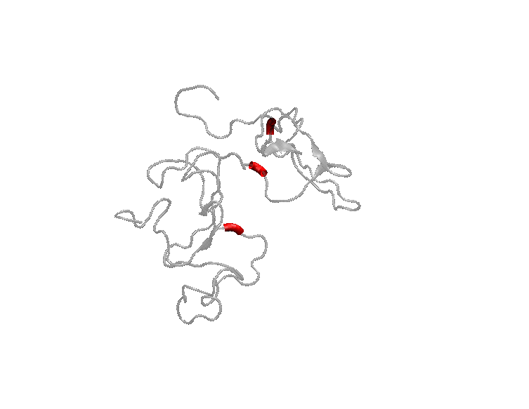

Welcome!

- [Work](#work)
  - [topology](#topology)
    - [topology in proteins](#topology-in-proteins)
      - [Project #1: 'link' in IDP](#project-1-link-in-idp)
      - [Project #2: knots in peptide](#project-2-knots-in-peptide)
    - [topology in glass](#topology-in-glass)
    - [topology in fluid physics](#topology-in-fluid-physics)
  - [Common Sense in physics](#common-sense-in-physics)
    - [More is different](#more-is-different)
- [Life](#life)
  - [Music](#music)
  - [Movie \& Animation](#movie--animation)

# Work

## topology

### topology in proteins

#### Project #1: 'link' in IDP

Intrinsically disordered proteins (IDP) play critical roles in various biological processes. However, their high flexibility presents a challenge in characterizing their intricate conformations using current methods. The aim of this project is to develop an effective and comprehensive topological analysis method for characterizing the structure of IDP. We utilize Gauss Linking Number (GLN) to calculate the relative position relationships of subchains and scan the whole chain to generate a matrix(denoted as GLN Map), which we then use to analyze the physical links and topological properties of IDP. 

Here is the movie of the dynamic process of linking revealed by GLN Map:

Furthermore, Link Nodes, key crossing points in physical link that affect the topological properties of the IDP chain, are extracted from the GLN map. Here is the movie of Link Node:

#### Project #2: knots in peptide

This project compares the probability of knots formation in various simulations(CG and AA).

### topology in glass

[simple simulations via LAMMPS](./topology_in_glass/MD_in_LAMMPS.md)

### topology in fluid physics

some useful articles:

- https://journals.aps.org/prl/abstract/10.1103/PhysRevLett.117.274501
- https://journals.aps.org/prl/abstract/10.1103/PhysRevLett.111.150404

## Common Sense in physics

### More is different

[note_P.W.Anderson](/common_sense_phy/note1.md)

# Life

## Music

[泛渡边品味合集](https://music.apple.com/cn/playlist/%E6%B3%9B%E6%B8%A1%E8%BE%B9%E5%93%81%E5%91%B3%E5%90%88%E9%9B%86/pl.u-9N9L2GyIxmJMP73)

[funeral list](https://music.apple.com/cn/playlist/funeral%E6%AD%8C%E5%8D%95/pl.u-DdANrpPsa124vlk)

## Movie & Animation

My top 5 movies：这个杀手不太冷 / 乱世佳人 / 美丽心灵 / 东京物语 / 卡萨布兰卡

My top 5 animations：星际牛仔 / 混沌武士 / EVA / 攻壳机动队（1995）/ 千年女优

